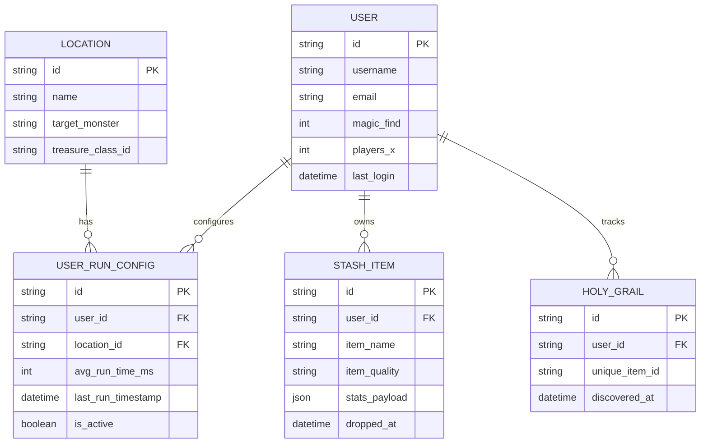
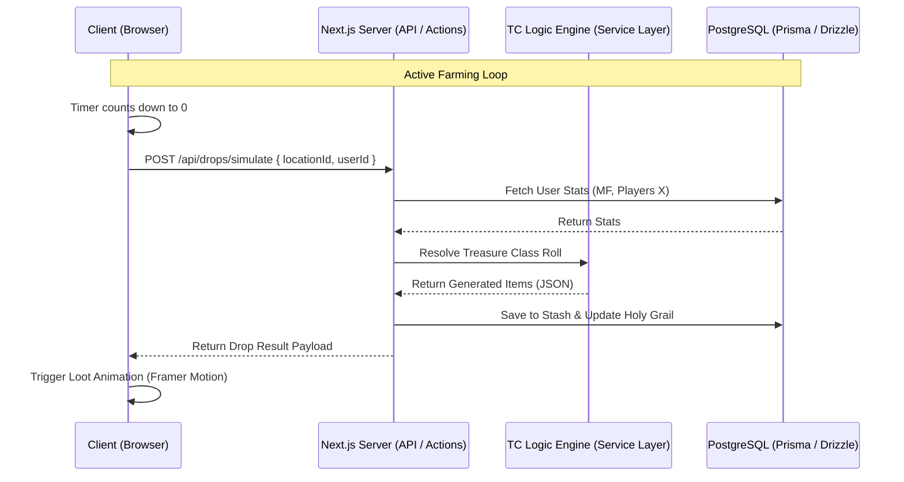

# Diablo 2 Idle Drop Simulator: Project Architecture

## 1. Project Overview

A web-based idle game that simulates the complex loot mechanics of Diablo 2. Players select farming locations (e.g., Travincal, Chaos Sanctuary), input their real-world average clear times, configure their character's Magic Find (MF) and "Players X" settings, and generate mathematically accurate loot tables in an active or offline idle loop.

---

## 2. Technology Stack

- **Full-Stack Framework:** Next.js (App Router)
  - Provides seamless integration between the React frontend and the backend API logic. Essential for preventing client-side cheating by resolving drop mathematics entirely on the server.
- **Frontend:**
  - **UI Library:** React 19 (via Next.js)
  - **Styling:** Tailwind CSS (for rapid UI development and Diablo-themed color coding)
  - **Animations:** Framer Motion (for physics-based loot drop animations simulation)
  - **State Management:** Zustand / React Context (for handling active game loops, timers, and local stash state)
  - **Drag & Drop:** `@dnd-kit/core` (for stash inventory management)
- **Backend & Database:**
  - **Server Logic:** Next.js Server Actions / Route Handlers (`src/app/api/*`)
  - **Domain & Services:** Modular service layer (`src/server/services/*`) protected with `server-only`
  - **Database:** PostgreSQL (for complex relational queries like the Holy Grail tracker)
  - **ORM:** Prisma or Drizzle (Type-safe database querying)
  - **Data Source:** Pre-parsed JSON/TS data for Diablo 2 Treasure Classes (TC), Item Stat limits, and Rune drops
- **Deployment & Hosting:**
  - **Platform:** Vercel
  - **Database Hosting:** Supabase or Neon Serverless Postgres

---

## 3. Project Folder Structure

The project adheres to a scalable, layered full-stack architecture rooted in `src/`. Server-side operations and domain logic are strictly decoupled from client-side presentation:

```text
d2r-simulator/
├── public/                     # Static assets (sprites, icons, audio, fonts)
├── src/
│   ├── app/                    # Next.js App Router (Routing, Layouts, Route Handlers)
│   │   ├── (auth)/             # Route group: Authentication pages (login, register)
│   │   ├── (game)/             # Route group: Main game view, stash, holy grail
│   │   ├── api/                # HTTP Route Handlers (API Endpoints)
│   │   │   ├── drops/          # /api/drops/simulate, /api/drops/offline-catchup
│   │   │   ├── locations/      # /api/locations
│   │   │   ├── runs/           # /api/runs/config
│   │   │   ├── inventory/      # /api/inventory/grail
│   │   │   └── health/         # /api/health
│   │   ├── favicon.ico
│   │   ├── globals.css         # Global Tailwind & base styling
│   │   ├── layout.tsx          # Root server layout
│   │   └── page.tsx            # Entry landing page
│   │
│   ├── components/             # React UI Components
│   │   ├── ui/                 # Reusable atomic design primitives (Button, Modal, Input, Badge)
│   │   ├── layout/             # Shell components (Header, Footer, Navigation, StashGridFrame)
│   │   └── modules/            # Domain composite views (LootDropAnimation, TCSelector, Timer)
│   │
│   ├── hooks/                  # Custom Client-Side React Hooks
│   │   ├── use-game-loop.ts    # Farming timer countdown and simulation trigger
│   │   └── use-stash.ts        # Client stash state management
│   │
│   ├── contexts/               # React Context Providers (App / Theme / Auth state)
│   │   └── index.tsx           # Global state providers
│   │
│   ├── styles/                 # Additional theme tokens and specialized Diablo CSS
│   │
│   ├── server/                 # 🔒 Backend Core (Server-Only Domain Logic & Data Layer)
│   │   ├── db/                 # Database connection singleton & ORM clients
│   │   │   ├── client.ts       # DB singleton (Prisma / Drizzle)
│   │   │   └── schema.ts       # Schemas & relational definitions
│   │   ├── repositories/       # Data Access Layer (queries, mutations, DB operations)
│   │   │   ├── user.repo.ts
│   │   │   ├── run.repo.ts
│   │   │   └── stash.repo.ts
│   │   ├── services/           # Business Logic & Math Orchestration
│   │   │   ├── tc-engine.service.ts # Recursive Treasure Class drop resolution
│   │   │   ├── drop.service.ts      # Active/offline drop orchestration
│   │   │   └── grail.service.ts     # Holy grail progress tracker
│   │   └── actions/            # Next.js Server Actions (Mutations & form handlers)
│   │
│   ├── middleware/             # Route protection, auth checks, rate limiting helpers
│   │
│   ├── lib/                    # Shared utilities, math helpers, and formatters
│   │   ├── utils.ts            # Class merging (cn), date formatting
│   │   └── tc-math.ts          # Magic Find Diminishing Returns & Players X nodrop formulas
│   │
│   ├── types/                  # TypeScript interfaces, DTOs, and global models
│   │   ├── api.types.ts        # API Request/Response contracts
│   │   ├── d2-loot.types.ts    # TC, Item Quality, Rune, and Stats types
│   │   └── index.ts
│   │
│   ├── constants/              # Static constants, D2 lookup tables, and route paths
│   │   ├── api-routes.ts       # Centralized API route URLs
│   │   ├── d2-tables/          # Pre-parsed TC tables, base items, unique/set items
│   │   └── index.ts
│   │
│   └── docs/                   # Architectural blueprints & engineering specifications
│       └── project-architecture.md
│
├── middleware.ts               # Next.js Root Edge Middleware
├── tsconfig.json               # Path aliases configuration
├── next.config.ts
└── package.json
```

### Path Aliases (`tsconfig.json`)

```json
{
  "compilerOptions": {
    "baseUrl": ".",
    "paths": {
      "@/*": ["./src/*"],
      "@/components/*": ["./src/components/*"],
      "@/hooks/*": ["./src/hooks/*"],
      "@/contexts/*": ["./src/contexts/*"],
      "@/styles/*": ["./src/styles/*"],
      "@/server/*": ["./src/server/*"],
      "@/services/*": ["./src/server/services/*"],
      "@/repositories/*": ["./src/server/repositories/*"],
      "@/db/*": ["./src/server/db/*"],
      "@/actions/*": ["./src/server/actions/*"],
      "@/middleware/*": ["./src/middleware/*"],
      "@/lib/*": ["./src/lib/*"],
      "@/types/*": ["./src/types/*"],
      "@/constants/*": ["./src/constants/*"]
    }
  }
}
```

---

## 4. Core Mechanics & Game Loops

### Active Game Loop
1. User selects a location and sets `avg_run_time_ms`.
2. Frontend runs a visual countdown timer (`useGameLoop`).
3. Upon reaching 0, frontend calls `POST /api/drops/simulate`.
4. Server calculates the drop based on Treasure Class (TC), Magic Find (MF), and Players X.
5. Server saves dropped items to the database and returns the JSON payload.
6. Frontend triggers Framer Motion animation to display loot.

### Offline Progress Loop (Idle Mechanic)
1. User opens the app after being away.
2. App fetches `last_active_timestamp` from the DB.
3. Calculates `time_elapsed`.
4. Calculates `total_missed_runs = time_elapsed / avg_run_time_ms`.
5. Server executes a bulk drop calculation (capped at a sensible limit to prevent timeouts/abuse) and adds items to the Stash.

---

## 5. Database Schema (ERD)



---

## 6. System Architecture (Flow Diagram)



---

## 7. Key API Endpoints

- `GET /api/locations`: Returns available farming zones and their base Treasure Classes.
- `POST /api/runs/config`: Saves the user's 3-run average time for a specific location.
- `POST /api/drops/simulate`: The core engine. Rolls against D2 loot tables.
- `POST /api/drops/offline-catchup`: Calculates offline time and processes bulk drops for the idle mechanic.
- `GET /api/inventory/grail`: Fetches the user's progress on finding all Unique/Set items in the game.
- `GET /api/health`: Health check status for infrastructure monitoring.

---

## 8. Implementation Roadmap

1. **Database & ORM Setup:** Connect PostgreSQL via Prisma/Drizzle and apply initial migrations based on the ERD.
2. **Data Ingestion:** Import D2 JSON data (`armor.json`, `weapons.json`, `TreasureClassEx.json`, `runes.json`) into `src/constants/d2-tables/`.
3. **TC Engine Implementation:** Build the recursive drop resolver inside `src/server/services/tc-engine.service.ts` (handling NoDrop adjustments, Magic Find diminishing returns, and TC cascades).
4. **UI & Game Loop:** Implement the interactive timer, stash viewer, and drop presentation components with Framer Motion.